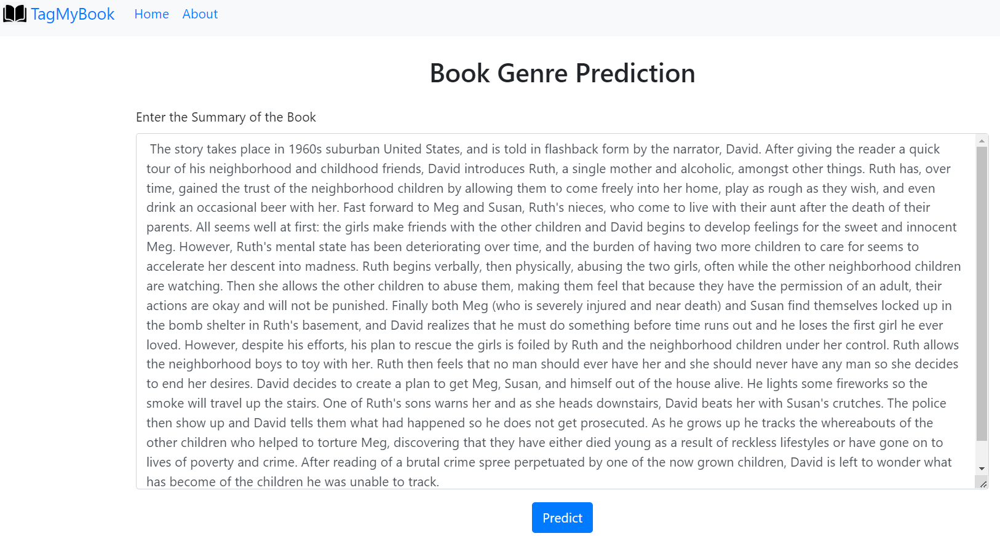
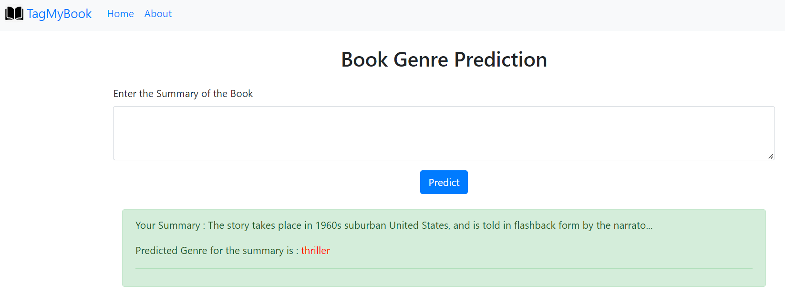

# Welcome to Book My Love!! 
---
## You tell me the summary of your book and I will tell you the genre<br> If I fail I will learn from it and if I pass then you will gain from it<br>

## Introduction 
The aim of this project is to accurately predict the genre of the book by looking at its synopsis.<br>
This will end the dependency on the readers to tag the book to know its genre <br>

## Methodology
1. Data Collection <br>
I have scraped the data from GoodReads which is world's most popular book review website. The data is scraped using selenium which is a browser automation tool also used for scraping.  
2. Text Cleaning <br>
The summary text is cleaned. Links, Punctutations, whitespace characters are removed and other cleaning procdures are undertaken
3. Text Preprocessing <br>
As a part of pre-processing the cleaned text is converted into vectors using a TF-IDF vectorizer
4. Model Building<br>
Currently I have used Multinomilal Naive Bayes and the support vector machine as  the classifiers. 
5. HyperParameter tuning 
Gridsearch CV is used to search for the optimiu parameters in svm such as the kernel, C value and alpha.
6. Evaluation 
Highest accuracy is obtained from SVM combined with the TF-IDF vectorizer.
7. App Creation
A simple looking web app is created using a flask framework.

## Run Locally
Clone the project

```
  git clone https://github.com/Athu7/BookMyLove.git
```

Go to the project directory

```
  cd my-project
```

Open cmd and install the requirements

```bash
  pip install -r requirements.txt
```
After the requirements are installed open the cmd in the project folder 
```bash
  flask run
```

## Application scrrenshots

<br>



